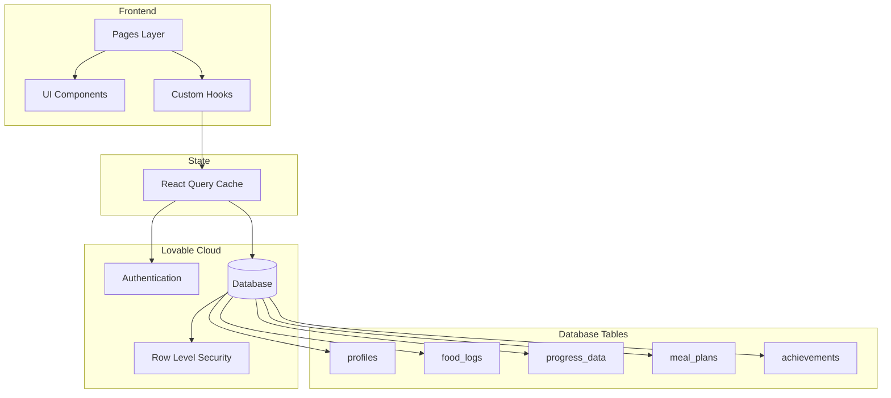

# NutriTrack

A modern fitness and nutrition tracking application built with React, TypeScript, and Lovable Cloud. Track your meals, monitor your progress, and achieve your health goals with an intuitive and beautiful interface.

## Features

### 🍽️ Food Logging
- Search and log meals throughout the day
- Track calories, protein, carbs, and fats
- Quick add from recent and popular foods
- Meal categorization (breakfast, lunch, dinner, snacks)

### 📊 Progress Tracking
- Daily calorie and macronutrient monitoring
- Visual progress indicators with circular charts
- Water intake tracking
- Workout completion tracking
- Historical progress data

### 🎯 Goal Management
- Set personalized calorie targets
- Track achievement progress
- Unlock achievements for milestones
- View your fitness journey over time

### 📅 Meal Planning
- Weekly meal plan overview
- Pre-planned meals with calorie counts
- Organized by day of week and meal type

### 👤 User Profiles
- Personalized user accounts
- Secure authentication
- Profile customization
- Activity level and dietary preferences

## Tech Stack

### Frontend
- **React 18** - UI library
- **TypeScript** - Type safety
- **Vite** - Build tool and dev server
- **Tailwind CSS** - Utility-first styling
- **shadcn/ui** - Component library
- **React Router** - Client-side routing
- **TanStack Query** - Data fetching and caching
- **date-fns** - Date manipulation
- **Recharts** - Data visualization
- **Lucide React** - Icon library

### Backend (Lovable Cloud)
- **Authentication** - Secure user sign-up and login
- **Database** - PostgreSQL with Row Level Security
- **Real-time** - Live data synchronization
- **Edge Functions** - Serverless backend logic

## Getting Started

### Prerequisites
- Node.js (v18 or higher)
- npm or yarn

### Installation

1. Clone the repository:
```sh
git clone <YOUR_GIT_URL>
cd <YOUR_PROJECT_NAME>
```

2. Install dependencies:
```sh
npm install
```

3. Start the development server:
```sh
npm run dev
```

The app will be available at `http://localhost:8080`

## Project Structure

```
src/
├── components/          # Reusable UI components
│   ├── ui/             # shadcn/ui components
│   ├── BottomNav.tsx   # Mobile navigation
│   ├── DashboardCard.tsx
│   ├── Layout.tsx      # App layout wrapper
│   └── ProgressRing.tsx
├── hooks/              # Custom React hooks
│   ├── useAuth.tsx     # Authentication state
│   ├── useProfile.tsx  # User profile data
│   ├── useTodayFoodLogs.tsx
│   └── useTodayProgress.tsx
├── pages/              # Application pages
│   ├── Auth.tsx        # Login/signup
│   ├── FoodLog.tsx     # Food logging interface
│   ├── Home.tsx        # Dashboard
│   ├── MealPlan.tsx    # Weekly meal planning
│   ├── Profile.tsx     # User settings
│   └── Progress.tsx    # Progress tracking
├── integrations/       # Third-party integrations
│   └── supabase/       # Lovable Cloud client
├── lib/                # Utilities
└── main.tsx           # App entry point
```

## Database Schema

### Tables

- **profiles** - User profile information and preferences
- **food_logs** - Individual food entries with nutritional data
- **progress_data** - Daily progress tracking (calories, macros, water)
- **meal_plans** - Weekly meal planning data
- **achievements** - User achievement tracking

All tables implement Row Level Security (RLS) to ensure users can only access their own data.

## Development

### Available Scripts

- `npm run dev` - Start development server
- `npm run build` - Build for production
- `npm run preview` - Preview production build
- `npm run lint` - Run ESLint

### Environment Variables

The project uses Lovable Cloud, which automatically configures:
- `VITE_SUPABASE_URL`
- `VITE_SUPABASE_PUBLISHABLE_KEY`
- `VITE_SUPABASE_PROJECT_ID`

## Deployment

Deploy your app instantly via Lovable:

1. Open your [Lovable Project](https://lovable.dev/projects/f9d11891-b1a3-45e9-9fda-7de94bc5c7b4)
2. Click **Share** → **Publish**
3. Your app will be live at `yourapp.lovable.app`

### Custom Domain

Connect a custom domain in Project → Settings → Domains.

[Learn more about custom domains](https://docs.lovable.dev/features/custom-domain)

## Contributing

1. Create a feature branch
2. Make your changes
3. Submit a pull request

## Architecture



## License

Built with ❤️ using [Lovable](https://lovable.dev)

## Support

- [Lovable Documentation](https://docs.lovable.dev/)
- [Lovable Discord Community](https://discord.com/channels/1119885301872070706/1280461670979993613)
- [Video Tutorials](https://www.youtube.com/watch?v=9KHLTZaJcR8&list=PLbVHz4urQBZkJiAWdG8HWoJTdgEysigIO)
